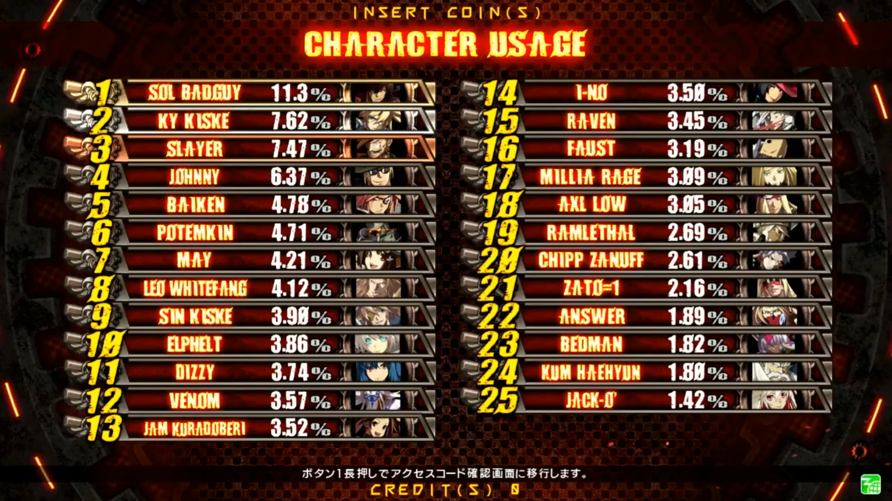

**Yosanzen!**

The meme comes from Maximilian (who did not say it) only playing Xrd very shortly with Baiken, which has more to do with the netcode and his own diverse streaming habits than everything else. A hype man jumping of Xrd shortly after release of a character? The perfect meme to bandwagon.

It's meme and not reality.  
In +R she is top tier, but guard cancels(that make her top tier) are a bit difficult as you have to time reverse fireball motions to your opponent rhythm. Usage of Baku("KI block") needs understanding of most characters.

In Rev2 she was considered low tier in the beginning (bad Def. mod, parry window and usage were more fiddly), but buffs brought her up. Not a lot of high lvl players switch characters, so her tournament representation was limited.

However, she was played a lot in other skill groups.

* most played female character
* top 6 overall with slayer and pot
* top polling every time

### self counted: 

### Mikado screen caps:

## 06.02.2019

## 17.10.2019

## 14.06.2020

## website: 
 whois:ARC SYSTEM WORKS with "梅喧"=Baiken